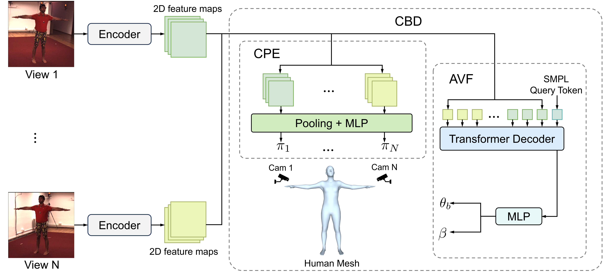
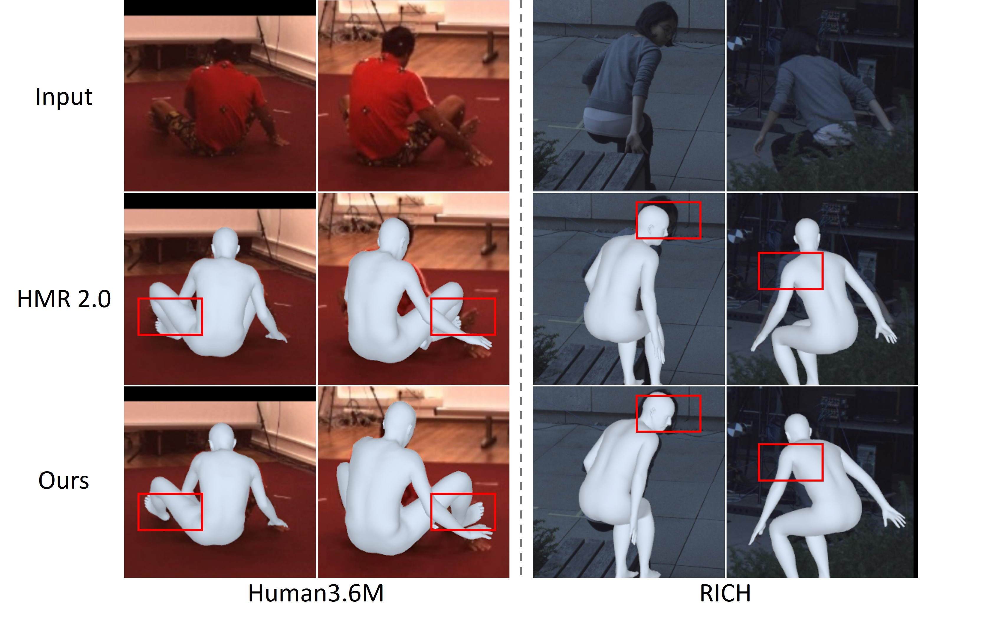

# Human Mesh Recovery from Arbitrary Multi-view Images

This repository contains the official implementation of our paper: Human Mesh Recovery from Arbitrary Multi-view Images. Xiaoben Li, Mancheng Meng, Ziyan Wu, Terrence Chen, Fan Yang*, Dinggang Shen. [paper](https://arxiv.org/abs/2403.12434)


**Abstract:** Human mesh recovery from arbitrary multi-view images involves two characteristics: the arbitrary camera poses and arbitrary number of camera views. Because of the variability, designing a unified framework to tackle this task is challenging. The challenges can be summarized as the dilemma of being able to simultaneously estimate arbitrary camera poses and recover human mesh from arbitrary multi-view images while maintaining flexibility. To solve this dilemma, we propose a divide and conquer framework for Unified Human Mesh Recovery (U-HMR) from arbitrary multi-view images. In particular, U-HMR consists of a decoupled structure and two main components: camera and body decoupling (CBD), camera pose estimation (CPE), and arbitrary view fusion (AVF). As camera poses and human body mesh are independent of each other, CBD splits the estimation of them into two sub-tasks for two individual sub-networks (\ie, CPE and AVF) to handle respectively, thus the two sub-tasks are disentangled. In CPE, since each camera pose is unrelated to the others, we adopt a shared MLP to process all views in a parallel way. In AVF, in order to fuse multi-view information and make the fusion operation independent of the number of views, we introduce a transformer decoder with a SMPL parameters query token to extract cross-view features for mesh recovery. To demonstrate the efficacy and flexibility of the proposed framework and effect of each component, we conduct extensive experiments on three public datasets: Human3.6M, MPI-INF-3DHP, and TotalCapture. 

## Installation

### Environment Setup

- OS: Linux
- python: 3.9.12
- pytorch: 1.11.0

You can create a conda environment use the following commands.

```
conda create --name U-HMR
source activate U-HMR
pip install -r requirements.txt
```
[Find the Docker environment here](https://pan.baidu.com/s/19eWya63THlsNeXJ_eDm6zg?pwd=7k7k)
### Data Setup

- **Human3.6M**: We follow the [H36M-Toolbox](https://github.com/CHUNYUWANG/H36M-Toolbox.git) to process Human3.6M dataset. And the SMPL annotations are from [PyMAF](https://github.com/HongwenZhang/PyMAF).
- **MPI-INF-3DHP**: We follow the process code from the dataset and the code from [SPIN](https://github.com/nkolot/SPIN). 
- **TotalCapture**: We follow the [TotalCature-Toolbox](https://github.com/zhezh/TotalCapture-Toolbox) and the code from the dataset.
- **Others**: Most of other data are from [SPIN](https://github.com/nkolot/SPIN) and [4D-Humans](https://github.com/shubham-goel/4D-Humans).

### Pretrained models
We provide a set of pretrained models using [BaiduDisk](https://pan.baidu.com/s/1rtV533AlhQ6PRq8u6YsGjA) (password:uhmr) and [OneDrive](https://1drv.ms/f/s!AqnMGeLS2QFOhbpt34u-GTmwNIpbRQ?e=aSWriS) as follows:
- ResNet50
- MLP
- Independent tokens
- Decoupling with MLP 
- Decoupling with Transformer decoder

## Model training and evaluation

### Code structure
The general structure of the project is as follows.
1. experiments: config files that contain arguments for performing experiments
2. lib: core code, contains datasets, models and utils
3. logs: tensorboard log directory
4. output: training model output directory
5. run.py: training and testing code that call the dataset and model functions
### Usage
```
python run.py --cfg_name cfg_file.yaml --dataset dataset_name
```
### Model Inference
```
python infer.py --cfg_name cfg_file.yam --image_dir ./test_data
```
--cfg_name: Path to the model configuration file
--image_dir: Directory containing test images

### Results
1. Tested on Human3.6M

|  |MPJPE|PA-MPJPE|
|--|--|--|
|Ours-SV(ResNet50)|52.9|42.5|
|Ours-SV(ViT)|43.3|32.6|
|Ours-MV(ResNet50)|36.3|28.3|
|Ours-MV(ViT)|31.0|22.8|

2. Qualitaive Results

## Acknowlegement

This work could not have been done without contributions from other open source projects, and we sincerely thank the contributor of those projects.

- [SPIN](https://github.com/nkolot/SPIN)
- [PyMAF](https://github.com/HongwenZhang/PyMAF)
- [4D-Humans](https://github.com/shubham-goel/4D-Humans)


## Citation
If you find this repository useful, please kindly cite our paper.
```
@misc{li2024uhmr,
      title={Human Mesh Recovery from Arbitrary Multi-view Images}, 
      author={Xiaoben Li and Mancheng Meng and Ziyan Wu and Terrence Chen and Fan Yang and Dinggang Shen},
      year={2024},
      eprint={2403.12434},
      archivePrefix={arXiv}
}

```
